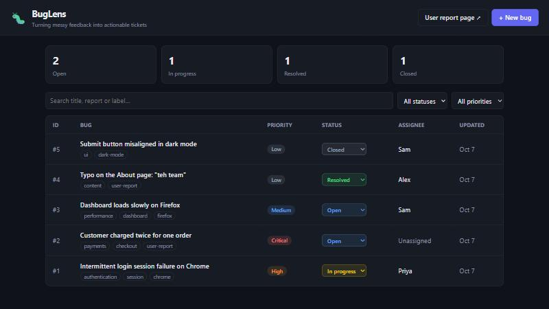
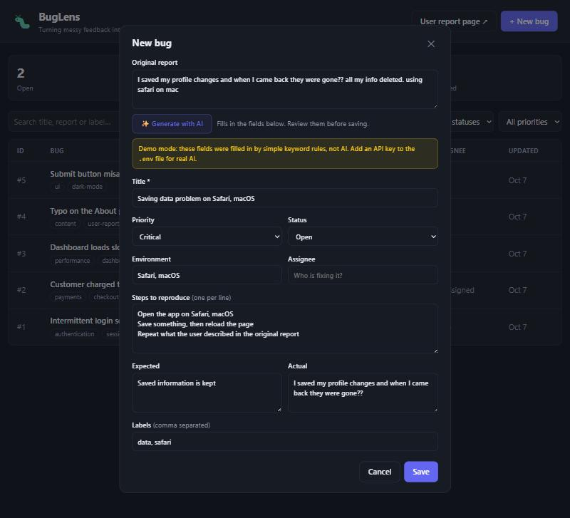
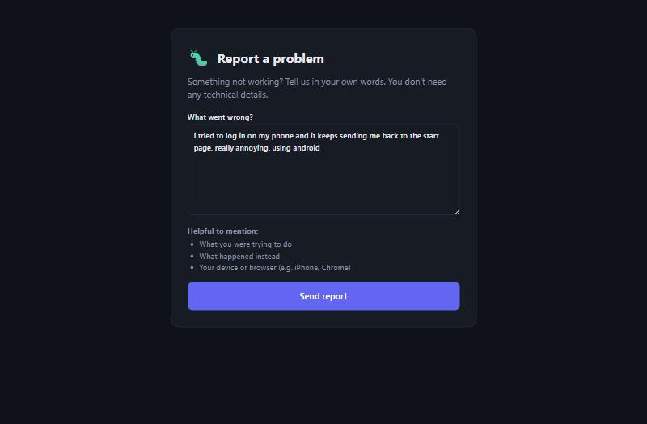

# 🐛 BugLens

**Turning messy user feedback into actionable engineering tickets.**

Users report bugs like *"the login thing doesn't work sometimes and I get kicked out."*
Developers need a title, priority, environment, reproduction steps, and expected vs. actual behaviour.
BugLens bridges that gap: paste a messy report, and it becomes a structured ticket on a team dashboard.

> **Live demo:** _coming soon_ · The online demo resets its data periodically.

```text
Messy user report  →  AI / rule-based processing  →  Structured ticket  →  Team dashboard
```

---

## Screenshots

**Team dashboard**: track, filter, search and update bugs



**✨ Generate with AI**: a messy report becomes a structured ticket, reviewed by a person before saving



**User report page**: users describe problems in their own words



---

## Features

- **Bug dashboard**: create, view, edit and delete bugs; status counts at a glance
- **Search and filters**: by status, by priority, and live search across titles, reports and labels
- **✨ AI ticket generation**: turns a messy report into title, priority, environment, steps, expected/actual and labels, using the Claude API with structured outputs
- **Demo mode fallback**: without an API key, a keyword-based rule engine fills in the ticket instead, so anyone can try the feature for free
- **Human in the loop**: AI output only fills the form; a person reviews it before saving
- **Public report page** (`/report`): users submit problems in plain language; reports are auto-structured, tagged `user-report`, and appear on the dashboard
- **Quick status changes** straight from the table
- **Dark mode** and **mobile-friendly** layout

## Tech stack

| Layer | Technology |
|---|---|
| Backend | Python, FastAPI, Uvicorn, Pydantic |
| Database | SQLite (raw SQL with parameterised queries) |
| Frontend | HTML, CSS, vanilla JavaScript (no build step) |
| AI | Anthropic Claude API (structured outputs) + rule-based fallback |
| Deployment | Docker, Render |

## How it works

```text
Browser (HTML/CSS/JS)
   │  fetch() JSON requests
   ▼
Uvicorn (web server)  ──►  FastAPI app (main.py)
                              ├── /api/bugs          CRUD, filters, search  ──►  SQLite (database.py)
                              ├── /api/ai/structure  messy report → ticket  ──►  Claude API (ai.py)
                              │                                                 or rules (rules.py)
                              └── /api/reports       public user reports
```

### API endpoints

| Method | Endpoint | Description |
|---|---|---|
| `GET` | `/api/bugs` | List bugs. Optional `?status=`, `?priority=`, `?q=` |
| `POST` | `/api/bugs` | Create a bug |
| `GET` | `/api/bugs/{id}` | Get one bug |
| `PATCH` | `/api/bugs/{id}` | Update some fields of a bug |
| `DELETE` | `/api/bugs/{id}` | Delete a bug |
| `POST` | `/api/ai/structure` | Turn a messy report into a suggested ticket (not saved) |
| `POST` | `/api/reports` | Submit a user report (structured and saved automatically) |
| `GET` | `/api/health` | Health check |

Interactive API docs are generated automatically at **`/docs`**.

## Design decisions

- **Structured outputs:** the AI must reply in an exact schema (a Pydantic model), so responses never need fragile text parsing.
- **Graceful fallback:** with no API key, a rule engine produces the same ticket shape, and the UI clearly labels it as demo mode.
- **User reports are never lost:** if AI processing fails, the report is still saved, tagged `needs-triage`.
- **Prompt-injection aware:** the AI is told to treat report text as data, never as instructions.
- **Security basics:** parameterised SQL queries (prevents SQL injection), HTML escaping on the frontend (prevents XSS), and server-side validation that doesn't rely on the browser.
- **Minimal data exposure:** the public report page only returns a reference number, never internal ticket details.

## Run it locally

**Requirements:** Python 3.11+

```bash
git clone https://github.com/<your-username>/buglens.git
cd buglens
python -m venv venv
venv\Scripts\activate          # Windows
# source venv/bin/activate     # macOS / Linux
pip install -r requirements.txt
uvicorn main:app --reload
```

Open <http://127.0.0.1:8000>. The user report page is at <http://127.0.0.1:8000/report>.
Example bugs are added automatically when the database is empty.

**Optional, real AI:** copy `.env.example` to `.env` and add your [Anthropic API key](https://console.anthropic.com). Without a key, BugLens runs in demo mode.

### Run with Docker

```bash
docker build -t buglens .
docker run -p 8000:8000 buglens
```

## Project structure

```text
buglens/
├── main.py           # FastAPI app: routes for pages, bugs, AI and user reports
├── database.py       # SQLite setup, example data, row conversion
├── schemas.py        # Pydantic models: what valid data looks like
├── ai.py             # Claude API integration (falls back to rules.py)
├── rules.py          # Demo mode: keyword-based ticket generation
├── static/
│   ├── index.html    # Team dashboard
│   ├── app.js        # Dashboard behaviour
│   ├── report.html   # Public "Report a problem" page
│   ├── report.js     # Report page behaviour
│   └── style.css     # Shared styles (light/dark, mobile)
├── Dockerfile
└── requirements.txt
```

## Limitations and next steps

- **No authentication:** anyone with the link can use the dashboard. Next: login, with assignees chosen from team members.
- **No rate limiting** on the public report page. Next: limit submissions per user, or add a CAPTCHA.
- **SQLite on free hosting resets** on restart. Next: a hosted database such as PostgreSQL.
- **Duplicate detection:** flag new reports that look like existing bugs, using text similarity or embeddings.
